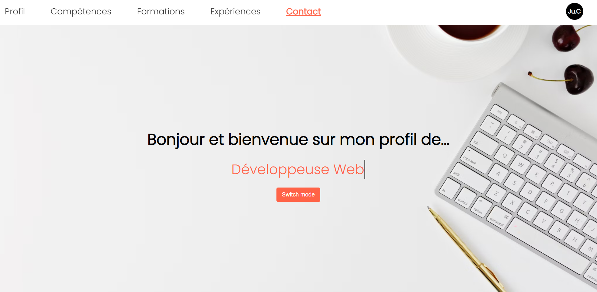

# 📄 CV Numérique

Mon curriculum vitae en ligne, accessible depuis n’importe quel appareil 📱💻.  
Le CV est optimisé pour mobile et desktop, et permet de présenter mes compétences, expériences et formations de façon claire et interactive.

---

## 🌟 Présentation du projet

Ce projet consiste à créer une **version numérique de mon CV** afin de le rendre consultable facilement depuis un navigateur.  
L’objectif est de proposer une interface **responsive**, agréable à lire, et intégrant éventuellement des animations ou interactions pour enrichir l’expérience utilisateur.

---

## 🎯 Objectifs et apprentissages

- Créer un CV numérique **responsive** en suivant le concept **Mobile First**  
- Optimiser l’affichage pour **mobile, tablette et desktop**  
- Ajouter des fonctionnalités interactives avec **JavaScript** (popups, animations, contrastes)  
- Déployer le CV en ligne avec **GitHub Pages**  
- Mettre en pratique les **bonnes pratiques front-end** et les standards W3C

---

## 🛠️ Technologies utilisées

| Outil / Langage | Rôle |
|-----------------|------|
| **HTML5**       | Structure du contenu |
| **CSS3**        | Mise en page et design |
| **JavaScript**  | Interactions et animations |
| **GitHub Pages**| Hébergement en ligne |
| **PDF**         | Version téléchargeable de mon CV |

---

## 💻 Fonctionnalités principales

✅ Version mobile optimisée (Mobile First)  
✅ Version desktop avec animations et interactions  
✅ Popups pour détails supplémentaires  
✅ Mode contrasté pour l’accessibilité  
✅ Lien vers la version PDF du CV  

---

## 🚀 Démo en ligne

🔗 [Accéder au CV en ligne](https://julie-charles16.github.io/cv-jch/)

---

## 🧭 Améliorations envisagées

- Ajouter des transitions et animations supplémentaires pour les sections
- Adapter les animations pour qu'elles fonctionnent correctement sur mobile (éviter les effets hover qui ne sont pas accessibles sur tous les appareils)
- Optimiser la vitesse et le score PageSpeed Insights
  

---

## 👩‍💻 À propos

Ce CV numérique a été réalisé dans le cadre de ma formation **Développeuse Web & Web Mobile** chez **Simplon Hauts-de-France**.  
Il me permet de présenter mes compétences et projets de façon moderne et interactive.

📍 **Autrice du projet et du README :** [Julie Charles](https://github.com/Julie-Charles16)  
💬 “Un projet pratique pour allier design, interactivité et accessibilité, et partager facilement mon CV avec les recruteurs.”

---

## 🧑‍🏫 Projet original fourni par

* [Nicolas Herbez](https://github.com/NicolasHerbez) — projet pédagogique de départ et README initial.
